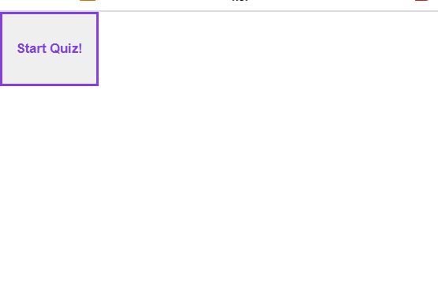
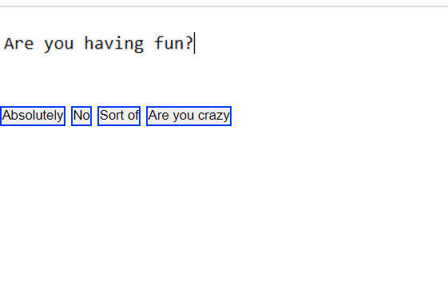
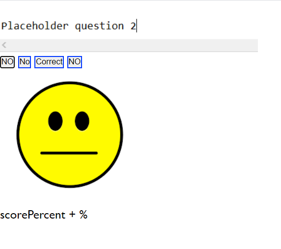

# quizHW
In this project we were asked to make a quiz. I made 2 questions and it functions somewhat without any errors.
I was unable to finish as I got stuck the quiz is taking my answers and they are stored I was kind of confused on where to go from here.
I will have to go back and finish this project.

Repo: https://github.com/EricMalpass/quizHW
Website: https://ericmalpass.github.io/quizHW/.

